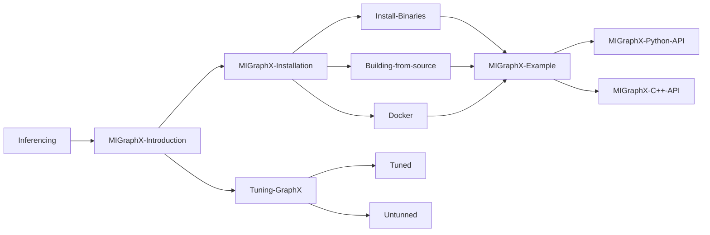

```mermaid
flowchart LR
    Inferencing-->MIGraphX-Introduction
    MIGraphX-Introduction-->MIGraphX-Installation
    MIGraphX-Installation--> Install-Binaries
    MIGraphX-Installation--> Building-from-source
    MIGraphX-Installation--> Docker
    Install-Binaries --> MIGraphX-Example
    Building-from-source --> MIGraphX-Example
    Docker --> MIGraphX-Example
    MIGraphX-Example--> MIGraphX-Python-API
    MIGraphX-Example--> MIGraphX-C++-API
    MIGraphX-Introduction--> Tuning-GraphX
    Tuning-GraphX --> Tuned
    Tuning-GraphX --> Untunned
    
    
    click Inferencing href "https://github.com/anubhavamd/Deep-Learning-Updated#51-inferencing"
    click MIGraphX-Introduction href "https://github.com/anubhavamd/Deep-Learning-Updated#511-migraphx-introduction"
    click MIGraphX-Installation href "https://github.com/anubhavamd/Deep-Learning-Updated#512-migraphx-installation"
    click Install-Binaries href "https://github.com/anubhavamd/Deep-Learning-Updated#5121-option-1-installing-binaries"
    click Building-from-source href "https://github.com/anubhavamd/Deep-Learning-Updated#5122-option-2-building-from-source"
    click Docker href "https://github.com/anubhavamd/Deep-Learning-Updated#5123-option-3-use-docker"
    click MIGraphX-Example href "https://github.com/anubhavamd/Deep-Learning-Updated#513-migraphx-example"
    click MIGraphX-Python-API href "https://github.com/anubhavamd/Deep-Learning-Updated#5131-migraphx-python-api"
    click MIGraphX-C++-API href "https://github.com/anubhavamd/Deep-Learning-Updated#5132-migraphx-c-api"
    click Tuning-GraphX href "https://github.com/anubhavamd/Deep-Learning-Updated#514-tuning-migraphx"
    click Tuned href "https://github.com/anubhavamd/Deep-Learning-Updated#tuned"
    click Untunned href "https://github.com/anubhavamd/Deep-Learning-Updated#untuned"
    
```
