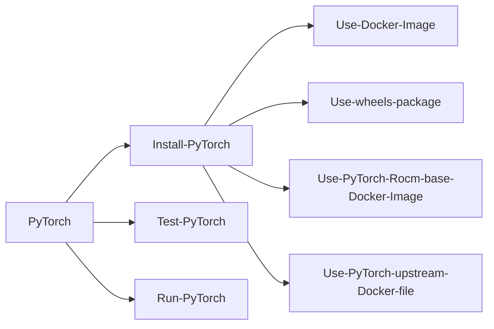

```mermaid
flowchart LR
    PyTorch-->Install-PyTorch
    PyTorch-->Test-PyTorch
    PyTorch-->Run-PyTorch
    Install-PyTorch-->Use-Docker-Image 
    Install-PyTorch-->Use-wheels-package
    Install-PyTorch-->Use-PyTorch-Rocm-base-Docker-Image
    Install-PyTorch-->Use-PyTorch-upstream-Docker-file
    
    click PyTorch href "https://github.com/anubhavamd/Deep-Learning-Updated#31-pytorch"
    click Install-PyTorch href "https://github.com/anubhavamd/Deep-Learning-Updated#311-installing-pytorch"
    click Test-PyTorch href "https://github.com/anubhavamd/Deep-Learning-Updated#312-test-the-pytorch-installation"
    click Run-PyTorch href "https://github.com/anubhavamd/Deep-Learning-Updated#313-run-a-basic-pytorch-example"
    click Use-Docker-Image href "https://github.com/anubhavamd/Deep-Learning-Updated#3111-option-1-recommended-use-docker-image-with-pytorch-pre-installed"
    click Use-wheels-package href "https://github.com/anubhavamd/Deep-Learning-Updated#3112-option-2-install-pytorch-using-wheels-package"
    click Use-PyTorch-Rocm-base-Docker-Image href "https://github.com/anubhavamd/Deep-Learning-Updated#3113-option-3-install-pytorch-using-pytorch-rocm-base-docker-image"
    click Use-PyTorch-upstream-Docker-file href "https://github.com/anubhavamd/Deep-Learning-Updated#3114-option-4-install-using-pytorch-upstream-docker-file"
    
```
