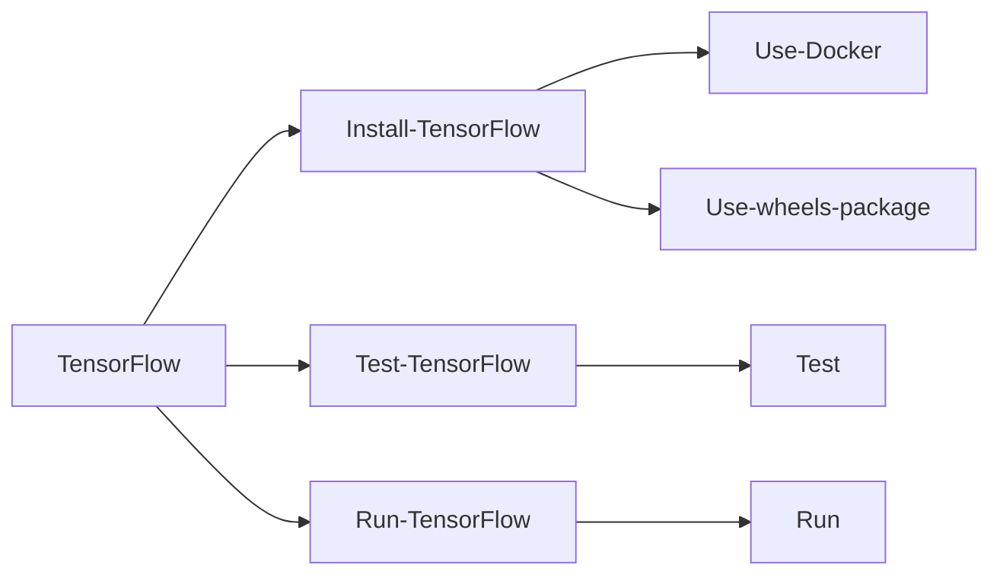

```mermaid
flowchart LR
    TensorFlow-->Install-TensorFlow
    TensorFlow-->Test-TensorFlow
    TensorFlow-->Run-TensorFlow
    Install-TensorFlow-->Use-Docker 
    Install-TensorFlow-->Use-wheels-package
    Test-TensorFlow-->Test
    Run-TensorFlow-->Run
    click TensorFlow href "https://github.com/anubhavamd/Deep-Learning-Updated#32-tensorflow"
    click  Install-TensorFlow href "https://github.com/anubhavamd/Deep-Learning-Updated#321-installing-tensorflow"
    click Test-TensorFlow href "https://github.com/anubhavamd/Deep-Learning-Updated#322-test-the-tensorflow-installation"
    click Run-TensorFlow href "https://github.com/anubhavamd/Deep-Learning-Updated#323-run-a-basic-tensorflow-example"
    click Use-Docker href "https://github.com/anubhavamd/Deep-Learning-Updated#3211-option-1-install-tensorflow-using-docker-image"
    click Use-wheels-package href "https://github.com/anubhavamd/Deep-Learning-Updated#3212-option-2-install-tensorflow-using-wheels-package"
    click Test href "https://github.com/anubhavamd/Deep-Learning-Updated#322-test-the-tensorflow-installation"
    click Run href "https://github.com/anubhavamd/Deep-Learning-Updated#323-run-a-basic-tensorflow-example"
```
