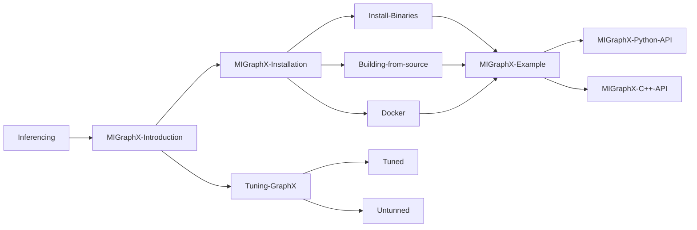

```mermaid
flowchart LR
    Inferencing-->MIGraphX-Introduction
    MIGraphX-Introduction-->MIGraphX-Installation
    MIGraphX-Installation--> Install-Binaries
    MIGraphX-Installation--> Building-from-source
    MIGraphX-Installation--> Docker
    Install-Binaries --> MIGraphX-Example
    Building-from-source --> MIGraphX-Example
    Docker --> MIGraphX-Example
    MIGraphX-Example--> MIGraphX-Python-API
    MIGraphX-Example--> MIGraphX-C++-API
    MIGraphX-Introduction--> Tuning-GraphX
    Tuning-GraphX --> Tuned
    Tuning-GraphX --> Untunned
    
    
    click Inferencing href "https://github.com/anubhavamd/Deep-Learning-Updated#51-inferencing"
    click MIGraphX href "https://github.com/anubhavamd/Deep-Learning-Updated#511-migraphx-introduction"
```
