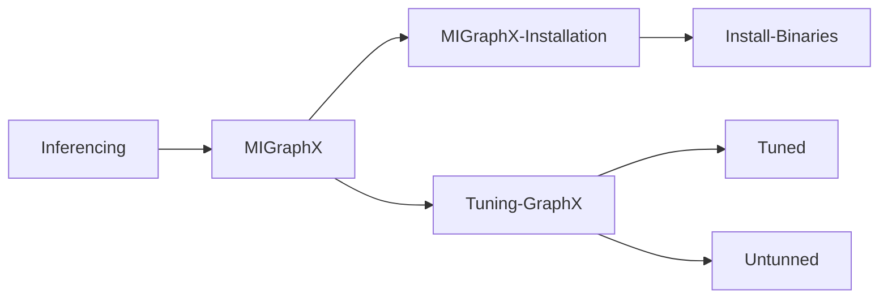

```mermaid
flowchart LR
    Inferencing-->MIGraphX
    MIGraphX-->MIGraphX-Installation
    MIGraphX-Installation--> Install-Binaries
    MIGraphX--> Tuning-GraphX
    Tuning-GraphX --> Tuned
    Tuning-GraphX --> Untunned
    
    
    click Inferencing href "https://github.com/anubhavamd/Deep-Learning-Updated#51-inferencing"
    click MIGraphX href "https://github.com/anubhavamd/Deep-Learning-Updated#511-migraphx-introduction"
```
